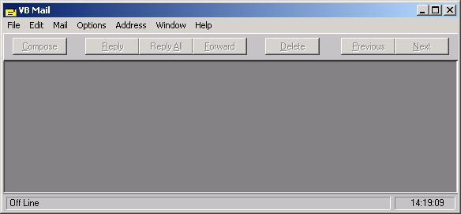



## VbMailer

### Description

This program uses the MAPI controls to interface with Outlook. You can view your address book, send and recieve mail, and do a lot more. This was originally submitted a year ago by me but now i put a screenshot with it. The MAPI control is not in the zip because I don't have it. This was written with VB 5.0 when I still had 4.0 installed. 4.0 came with MAPI, so after I uninstalled 4, I lost MAPI. Please vote for me. E-Mail me at et7809@yahoo.com
 
### More Info
 

             |
---                |---
**Submitted On**   |1999-06-25 23:46:20
**By**             |[Evan T\.](https://github.com/Planet-Source-Code/PSCIndex/blob/master/ByAuthor/evan-t.md)
**Level**          |Intermediate
**User Rating**    |4.8 (24 globes from 5 users)
**Compatibility**  |VB 4\.0 \(32\-bit\), VB 5\.0, VB 6\.0
**Category**       |[Complete Applications](https://github.com/Planet-Source-Code/PSCIndex/blob/master/ByCategory/complete-applications__1-27.md)
**World**          |[Visual Basic](https://github.com/Planet-Source-Code/PSCIndex/blob/master/ByWorld/visual-basic.md)
**Archive File**   |[CODE\_UPLOAD559\.zip](https://github.com/Planet-Source-Code/evan-t-vbmailer__1-3167/archive/master.zip)

